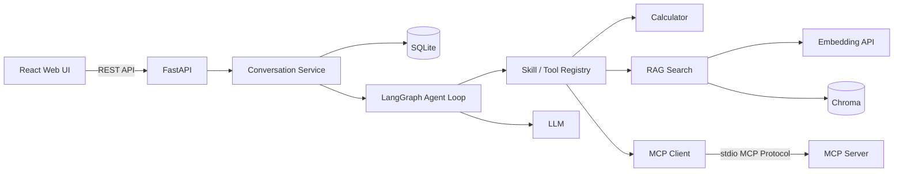

# AI Workspace Agent

一个面向企业知识问答场景的全栈 AI Application（AI 应用）作品集项目。它不是一次性的 LLM（大语言模型）接口包装，而是包含可持久化会话、RAG（检索增强生成）、LangGraph Agent Loop（智能代理循环）、安全 Tool Calling（工具调用）、Skill Registry（技能注册表）和真实 MCP（模型上下文协议）通信的完整系统。

## 核心能力

- React 19 + Vite 前端，提供会话 CRUD、Agent 模式、知识库管理和执行轨迹。
- FastAPI 后端，使用 Pydantic 校验输入并提供 OpenAPI 文档。
- SQLite 持久化会话、消息和不含隐藏思维链的 Agent 执行元数据。
- Chroma PersistentClient 持久化知识库向量。
- DashScope 千问 Chat Completion 与 `text-embedding-v4`。
- LangGraph 有限循环，支持连续工具决策，最大执行步数为 5。
- Calculator、Knowledge、Task Skill 与动态 MCP Tool Registry。
- MCP Client 真实执行 `initialize()`、`list_tools()` 和 `call_tool()`。
- 文档大小、编码、扩展名与基础 Prompt Injection（提示词注入）检测。
- 可选 Bearer Token（持有者令牌）保护、单实例限流、错误脱敏和模型超时。
- Pytest 自动测试、可重复离线评测、前端 Lint/Build 和 GitHub Actions CI。
- 非 root Docker 镜像、健康检查、最小 Capability（系统能力）与持久化 Volume。

## 系统架构



## Agent 工作流程

1. 后端保存用户消息并加载最近 20 条历史。
2. Agent 将允许的 Tool Schema（工具结构定义）提供给模型。
3. 模型根据问题自主决定直接回答，或选择 Calculator、RAG、MCP Tool。
4. 工具参数经过 Pydantic 或 JSON Schema 严格校验。
5. 工具结果被标记为不可信数据，再交给模型生成最终回答。
6. 最多执行 5 个 Agent/Tool 步骤，避免无限循环。
7. 助手回答与安全 Trace（轨迹）以独立数据结构持久化。

## 真实 MCP 集成

MCP 工具没有通过普通 Python import 伪装调用。客户端实际执行：

```text
stdio_client
  → ClientSession
  → initialize()
  → list_tools()
  → call_tool()
```

当前 MCP Server 提供：

- `get_current_time`
- `calculate_text_stats`

Server 工具必须再通过后端 Allowlist（允许列表）才能动态注册。MCP 子进程只继承启动必需的环境变量，不继承模型 API Key。

## 目录结构

```text
backend/
├── app/
│   ├── agent/          # LangGraph、工具技能、动态注册表
│   ├── memory/         # SQLite 会话与执行轨迹
│   ├── mcp/            # MCP Client
│   ├── rag/            # 切块、Embedding、Chroma 与知识库目录
│   ├── skills/         # 任务型 Prompt Skill
│   └── main.py         # FastAPI 入口
├── mcp_servers/        # 独立 MCP Server
└── tests/              # Unit、Integration 和 Eval

frontend/
└── src/                # React 页面、会话、知识库与 Trace UI
```

## 快速启动

### 1. 配置环境

复制示例配置：

```powershell
Copy-Item backend/.env.example backend/.env
```

编辑 `backend/.env`，至少填写新的 `DASHSCOPE_API_KEY`。公开部署时还必须设置高强度随机 `APP_ACCESS_TOKEN` 和正式 `CORS_ALLOWED_ORIGINS`。

不要把 `.env`、密钥、SQLite 文件或 Chroma 数据提交到 Git。

### 2. Docker Compose 启动

在项目根目录执行：

```powershell
cd C:\Users\24315\Desktop\AI\ai-workspace-agent\ai-workspace-agent
docker compose up --detach --build
docker compose ps
```

- `--build`：启动前重新构建前后端镜像。
- `--detach`：让服务在后台运行。
- `docker compose ps`：查看容器是否启动且健康。

查看日志和停止服务：

```powershell
docker compose logs --follow
docker compose down
```

`logs --follow` 会持续显示日志；`down` 会停止并删除容器，但不会删除 `backend/data` 中的 SQLite 和 Chroma 持久化数据。

启动后访问：

- 前端：http://localhost:5173
- 健康检查：http://localhost:8000/api/health
- OpenAPI：http://localhost:8000/docs

如果配置了 `APP_ACCESS_TOKEN`，前端会显示访问令牌输入页。令牌只保存在当前浏览器标签页的 Session Storage（会话存储）中。

### 3. 本地开发

打开第一个 PowerShell 窗口启动后端：

```powershell
cd C:\Users\24315\Desktop\AI\ai-workspace-agent\ai-workspace-agent\backend
python -m venv venv
.\venv\Scripts\Activate.ps1
python -m pip install -r requirements.txt
python -m uvicorn app.main:app --reload
```

`--reload` 会在后端代码变化后自动重启开发服务。后端默认地址为 http://localhost:8000。

打开第二个 PowerShell 窗口启动前端：

```powershell
cd C:\Users\24315\Desktop\AI\ai-workspace-agent\ai-workspace-agent\frontend
npm ci
npm run dev
```

`npm ci` 按锁文件安装依赖；`npm run dev` 启动 Vite 开发服务器，默认地址为 http://localhost:5173。

## 主要 API

| 方法 | 地址 | 作用 |
|---|---|---|
| GET | `/api/health` | 健康状态和访问保护状态 |
| POST | `/api/agent/chat` | 前端使用的 Agent 接口，可自主选择工具 |
| POST | `/api/chat` | 兼容旧客户端，同样进入 Agent 执行链 |
| GET/POST | `/api/conversations` | 分页查询/创建会话 |
| PATCH/DELETE | `/api/conversations/{id}` | 重命名/删除会话 |
| GET | `/api/conversations/{id}/messages` | 分页恢复消息和 Trace |
| POST | `/api/documents/upload` | 一次上传并索引多个 TXT、MD、DOCX、PDF 文档 |
| POST | `/api/documents/search` | 直接检索知识库 |
| GET/DELETE | `/api/knowledge-bases` | 查询/删除知识库 |
| DELETE | `/api/knowledge-bases/{id}/documents/{document_id}` | 单独删除文档及其向量 |

除健康检查外，配置 `APP_ACCESS_TOKEN` 后所有 `/api/*` 请求都需要 Bearer Token。

## 测试与评测

后端：

```powershell
cd backend
.\venv\Scripts\python.exe -m compileall -q app mcp_servers
.\venv\Scripts\python.exe -m pytest -q
.\venv\Scripts\python.exe -m tests.evals.runner
```

前端：

```powershell
cd frontend
npm run lint
npm run build
```

评测使用可控 Fake LLM（模拟大模型），但执行真实 LangGraph、Tool、Chroma 和 MCP 路径，用于稳定验证路由和安全回归；它不等于真实线上模型准确率。

## 安全设计

- 密钥只从后端环境变量读取，`.env` 被 Git 和 Docker Build Context 排除。
- MCP 子进程使用环境变量允许列表，且不经过 Shell 启动。
- 本地工具使用 Pydantic，MCP 工具使用 JSON Schema 校验参数。
- MCP Tool Result 被视为外部不可信数据。
- 文档上传支持 TXT、Markdown、DOCX、电子 PDF 和扫描版 PDF；扫描页面自动使用离线中文 OCR（单份最多 30 页）。后续上传默认追加到当前知识库，不覆盖已有文档；单文件最大 10 MB、单次最多 10 个且总计不超过 30 MB，并进行基础注入标记检测。
- API 返回通用错误，内部异常类型只写服务端日志。
- 同一会话在单进程内串行执行，失败轮次回滚用户消息。
- Agent 设有执行步数和每轮工具调用数量上限。
- Docker 使用非 root 用户、健康检查和最小权限配置。

## 已知边界

- `APP_ACCESS_TOKEN` 是单用户部署保护，不是完整多租户认证。多用户版本必须增加用户表、登录流程和会话/知识库所有权检查。
- SQLite 与进程内限流适合单实例作品集部署；多副本环境应改用共享数据库、Redis 限流和分布式锁。
- Prompt Injection 检测是多层缓解措施，不保证识别所有变体。
- 当前 RAG 以向量检索和严格原文约束为主，后续可增加引用、混合检索和 Reranker。
- MCP 当前每次操作创建独立 stdio Session，隔离性好但存在进程启动开销。
- 真实模型质量、延迟和成本应通过独立线上评测持续跟踪。

## 面试可讲亮点

- 为什么把模型可控性放在 Tool Schema、Registry、Skill Allowlist 和最大步数四层完成。
- 为什么知识库 ID 由后端上下文注入，而不允许模型生成。
- 如何证明 MCP 是真实协议调用，而不是直接 import Server 函数。
- 如何隔离用户消息、工具结果、执行 Trace 和模型隐藏思维链。
- 如何在 RAG 零命中、MCP 故障和工具参数错误时安全降级。
- SQLite/Chroma 的作品集取舍，以及迁移到多租户生产架构的路径。
